# Giydir — Enterprise AI Fashion & Virtual Try-On Platform

Giydir is an enterprise-grade SaaS platform that operates as an intelligent orchestration layer between complex, multi-stage machine learning pipelines and a reactive, real-time frontend. It is engineered to serve high-volume generative AI workloads for the fashion industry, including Virtual Try-On (VTON), AI-driven photoshoots, and cinematic advertisement animations.

The platform is designed and built to meet the reliability, security, and scalability requirements of global B2B clients operating at production scale.

> The source code of this repository is proprietary and is not publicly available. This document describes the architecture, engineering decisions, and technical implementation of the system for portfolio and technical review purposes.

---

## Table of Contents

- [Overview](#overview)
- [Outputs](#sample-outputs)
- [System Architecture](#system-architecture)
- [Technology Stack](#technology-stack)
- [Core Architectural Components](#core-architectural-components)
  - [Enterprise B2B Architecture](#1-enterprise-b2b-architecture-batching-and-billing)
  - [Multi-Stage AI Orchestration and VTON Pipeline](#2-multi-stage-ai-orchestration-and-vton-pipeline)
  - [Advanced Prompt Engineering and Semantic Generation](#3-advanced-prompt-engineering-and-semantic-generation)
  - [Event-Driven Webhooks and Enterprise Dispatcher](#4-event-driven-webhooks-and-enterprise-dispatcher)
  - [Resiliency and High-Volume Concurrency](#5-resiliency-and-high-volume-concurrency)
  - [Security and Multi-Tenant Infrastructure](#6-security-and-multi-tenant-infrastructure)
- [Design Principles](#design-principles)
- [Disclaimer](#disclaimer)

---

## Overview

Giydir functions as the orchestration backbone connecting client applications, external AI providers, and internal domain logic. The system is responsible for managing the full lifecycle of a generative AI request: ingestion, validation, orchestration across multiple AI pipeline stages, asynchronous processing, billing, and delivery of results back to the client through real-time and webhook-based channels.

The architecture follows strict Clean Architecture principles, with clear separation between business logic, external service abstractions, and infrastructure concerns. Factory patterns and dependency injection are used extensively to manage memory footprint and concurrency under production load.

## System Architecture

```mermaid
graph TD
    classDef client fill:#2D3748,stroke:#4A5568,stroke-width:2px,color:#fff,rx:8px,ry:8px;
    classDef gateway fill:#4A5568,stroke:#718096,stroke-width:2px,color:#fff,rx:8px,ry:8px;
    classDef core fill:#2B6CB0,stroke:#4299E1,stroke-width:2px,color:#fff,rx:8px,ry:8px;
    classDef pipeline fill:#553C9A,stroke:#805AD5,stroke-width:2px,color:#fff,rx:8px,ry:8px;
    classDef worker fill:#C05621,stroke:#ED8936,stroke-width:2px,color:#fff,rx:8px,ry:8px;
    classDef external fill:#276749,stroke:#48BB78,stroke-width:2px,color:#fff,rx:8px,ry:8px;
    classDef data fill:#744210,stroke:#D69E2E,stroke-width:2px,color:#fff,rx:8px,ry:8px;

    Client["Blazor Server UI (Real-time SignalR)"]:::client
    Gateway["ASP.NET Core 9 API Gateway (Rate Limits and JWT)"]:::gateway
    WebhookAPI["Svix Webhook Ingress (HMAC-SHA256 Auth)"]:::gateway

    subgraph "Domain Core and Event Orchestration"
        Orchestrator["Render Orchestrator (Multi-Stage AI Pipeline)"]:::core
        PromptEngine["Hybrid Prompt Architect (Strategy Pattern)"]:::core
        Debouncer["SignalR Debouncer"]:::core
        B2BWebhook["Enterprise Webhook Dispatcher"]:::core
        Gatekeeper["Subscription Gatekeeper (RBAC and Quotas)"]:::core
    end

    subgraph "AI / VTON Pipeline Engine"
        VTON["VTON Service"]:::pipeline
        Landmark["Landmark Service"]:::pipeline
        GarmentClass["Hybrid Garment Classifier"]:::pipeline
        Composite["Image Composer"]:::pipeline
    end

    subgraph "Asynchronous Distributed Workers"
        HangfireCore["Hangfire Core (System and Billing Jobs)"]:::worker
        HangfireBatch["Batch Factory (High Volume AI, 20 Workers)"]:::worker
        PythonML["Local ML Microservices (Pose and Background)"]:::worker
    end

    subgraph "External Providers"
        FalAI["Fal.ai API (VTON / Cinema Ads)"]:::external
        GroqGemini["Groq / Gemini (Vision and LLaMA 70B)"]:::external
        Stripe["Stripe API (Payments)"]:::external
    end

    subgraph "Persistence and Object Storage"
        PostgreSQL["PostgreSQL (EF Core 9)"]:::data
        CloudflareR2["Cloudflare R2 / AWS S3 (High-Availability Blobs)"]:::data
    end

    Client <-->|WebSockets, 32MB Max| Debouncer
    Client -->|HTTP/JWT| Gateway
    Client -->|100MB File Chunks| Gateway
    WebhookAPI --> Orchestrator

    Gateway --> Orchestrator
    Gateway --> Gatekeeper
    Gatekeeper --> Stripe

    Orchestrator --> VTON
    Orchestrator --> PromptEngine
    Orchestrator --> HangfireBatch

    VTON --> Landmark
    VTON --> GarmentClass
    VTON --> Composite

    PromptEngine --> GroqGemini
    HangfireBatch --> FalAI
    HangfireBatch --> PythonML

    FalAI -->|Async Webhook| WebhookAPI
    Orchestrator --> B2BWebhook

    HangfireCore --> PostgreSQL
    HangfireBatch --> PostgreSQL
    Orchestrator --> CloudflareR2
```

## Sample Outputs
 
Direct outputs from the VTON pipeline described above — no manual retouching. Fabric drape and texture hold up across poses and lighting, and hands/accessories don't warp or merge into garments, which is where most VTON pipelines visibly break down.
 

## Technology Stack

| Layer | Technology |
|---|---|
| Backend Framework | .NET 9, ASP.NET Core |
| Frontend | Blazor Server, SignalR |
| Background Processing | Hangfire (segmented worker servers) |
| Database | PostgreSQL, Entity Framework Core 9 |
| Object Storage | Cloudflare R2, AWS S3 |
| AI / ML Providers | Fal.ai, Groq, Gemini Vision |
| Computer Vision | Local Python microservices (pose detection, background removal) |
| Payments | Stripe |
| Webhooks | Svix (inbound), custom HMAC-signed dispatcher (outbound) |
| Resilience | Polly / .NET Resilience Pipelines |

## Core Architectural Components

### 1. Enterprise B2B Architecture (Batching and Billing)

- **High-volume batch upload controller.** A purpose-built `BatchUploadController` parses 100MB chunked multipart configurations in memory and streams data asynchronously to cloud storage, avoiding local disk I/O entirely.
- **Idempotent Stripe webhooks.** The `StripeWebhookService` validates every incoming webhook against a `ProcessedWebhooks` table in PostgreSQL, guaranteeing idempotency and eliminating race conditions or double-billing during transient network failures.
- **Granular ledger and credit system.** A dedicated `ICreditService`, combined with specialized DTOs such as `UserCreditUsageDTO`, tracks the compute cost of AI GPU executions with micro-cent precision, supporting accurate metered billing for B2B SaaS customers.

### 2. Multi-Stage AI Orchestration and VTON Pipeline

- **Render Orchestrator.** The `RenderOrchestrator` operates as a state machine governing Virtual Try-On generation. It manages waterfall logic across webhook-driven stages, progressing generations through the sequence: Idle, Structural Fit, Upscale, and Cinema Ad (video animation).
- **Computer vision microservices.** Specialized local Python services (`PythonPoseDetectionService`, `PythonBackgroundRemovalService`) are bridged to the .NET core and operate alongside a `LandmarkService` and `HybridGarmentClassifier` to precisely map garments onto generated models.
- **Image composer.** The `ICompositeGenerator` merges, masks, and layers generated assets before dispatching them to cloud GPU providers.

### 3. Advanced Prompt Engineering and Semantic Generation

- **Hybrid Prompt Architect.** The `IPromptArchitect` is a dynamic prompt engine that leverages large language models, including Groq's LLaMA 70B and Gemini Vision, to construct context-aware generation prompts.
- **Strategy pattern for fashion domains.** Domain-specific strategies (`ClothingPromptStrategy`, `JewelryPromptStrategy`, `ShoesPromptStrategy`) automatically inject the correct semantic vocabulary based on the type of garment or accessory uploaded by the user.

### 4. Event-Driven Webhooks and Enterprise Dispatcher

- **Svix-standard webhook ingress.** The API securely receives asynchronous GPU rendering results from external providers such as Fal.ai, validating every payload with strict HMAC-SHA256 signatures and fallback verification chains.
- **Enterprise webhook dispatching.** An outbound webhook engine, `DispatchEnterpriseWebhook`, signs generated results with a custom `X-Atelier-Signature` header and delivers them asynchronously, on a fire-and-forget basis, to corporate clients' custom endpoints.

### 5. Resiliency and High-Volume Concurrency

- **Segmented Hangfire workers.** Multiple Hangfire servers connect to PostgreSQL, with standard operations routed to `Giydir-Core` and high-cost AI executions isolated to a dedicated `Giydir-Batch-Factory`, configured with 20 workers and custom polling intervals to prevent provider rate limiting (HTTP 429).
- **Polly and .NET Resilience Pipelines.** All API calls to GPU providers apply `AddStandardResilienceHandler` with extended timeouts of up to 600 seconds, circuit breakers, and exponential backoff to ensure job continuity under sustained high load.
- **SignalR debouncer.** An injected `SignalRDebouncerService` batches real-time WebSocket notifications to the client UI, preventing TCP bottlenecks when large numbers of image generations complete concurrently.

### 6. Security and Multi-Tenant Infrastructure

- **Subscription Gatekeeper.** The `ISubscriptionGatekeeper` enforces strict role-based access control, evaluating permission nodes such as `res_4k`, `batch_unlimited`, and `can_animate` before allowing a request to enter the processing pipeline.
- **Endpoint rate limiting.** .NET 9 rate limiting middleware enforces dual policies: `ApiGeneral`, limited to 100 requests per minute for standard UI queries, and `AiProduction`, limited to 10 requests per minute for expensive AI generation endpoints.
- **DbContextFactory for Blazor Server.** Scoped, lightweight `DbContext` instances are spawned strictly as needed, resolving transient concurrency exceptions inherent to stateful Blazor Server circuits.
- **Cloudflare R2 / AWS S3 abstraction.** All assets are persisted through an `IFileStorageService` abstraction, enabling zero-downtime switching between local and cloud object storage providers.

## Design Principles

- **Clean Architecture.** Strict separation of concerns between domain logic, application services, and infrastructure, ensuring the core business rules remain independent of external frameworks and providers.
- **Provider abstraction.** All third-party AI and infrastructure providers are accessed through internal interfaces, allowing providers to be replaced or extended without impacting the domain core.
- **Asynchronous by default.** Long-running AI operations are treated as asynchronous, event-driven processes rather than blocking requests, ensuring the system remains responsive under production load.
- **Production-grade resilience.** Every external dependency is wrapped with timeout, retry, and circuit-breaker policies appropriate to its criticality and expected latency profile.

## Disclaimer

This README describes a proprietary, closed-source system. It is published for the purpose of technical documentation and portfolio review. No source code, credentials, or proprietary business logic are included in this repository.
